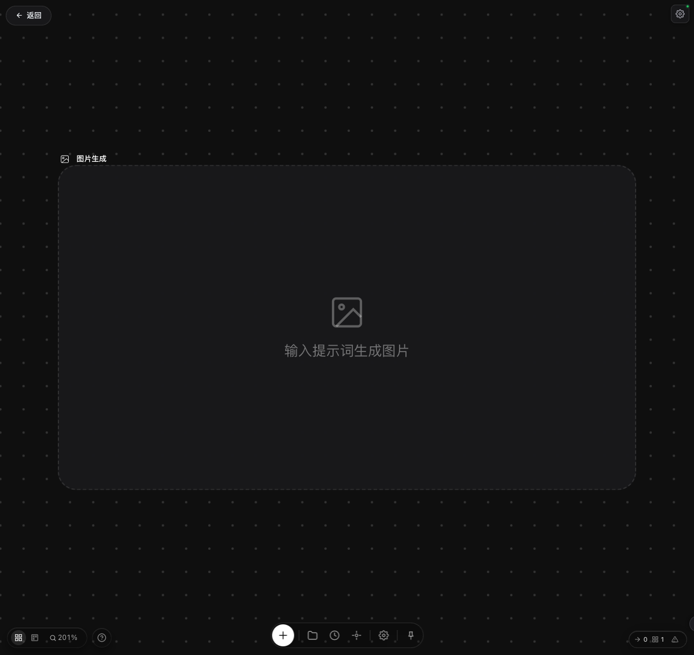

# Wang Local

Wang Local is a local Node.js wrapper around a bundled Wang canvas frontend. It serves the saved frontend assets, provides local/mock API adapters, and can forward image-generation requests to an OpenAI-compatible image endpoint.

The project is intended for local development, UI restoration, workflow testing, and lightweight backup of the current runnable state.



## Features

- Serves the bundled Wang canvas frontend from `wang-local/`.
- Provides local authentication and settings patches through `auth-mock.js` and `settings-ui.js`.
- Supports OpenAI-compatible image generation configuration, including multiple API profiles and a streaming toggle.
- Supports local image-to-image style workflows used by pose reference and camera-angle adjustment.
- Stores local generated media, canvas sessions, generation history, and asset-library data under `wang-local/generated/`.
- Keeps local secrets, generated media, dependency folders, and browser-save artifacts out of Git.

## Project Structure

```text
.
|-- README.md
|-- PROJECT_AUDIT.md
|-- docs/
|   `-- screenshot.png
`-- wang-local/
    |-- assets/
    |-- auth-mock.js
    |-- config.example.json
    |-- index.html
    |-- package.json
    |-- server.js
    `-- settings-ui.js
```

## Requirements

- Node.js 18 or newer
- npm
- An OpenAI-compatible image-generation API, if real generation is required

## Quick Start

```bash
cd wang-local
npm install
npm run dev
```

Open the local workspace:

```text
http://localhost:3456/workflow?workspaceId=demo
```

The default port is `3456`. It can be changed in `wang-local/config.json`.

## Configuration

Copy the example config and fill in your local API settings:

```bash
cp wang-local/config.example.json wang-local/config.json
```

Important fields:

- `port`: local server port.
- `apiBaseUrl`: upstream OpenAI-compatible API base URL.
- `apiKey`: API key for the default upstream.
- `openaiProfiles`: multiple independent OpenAI-compatible API profiles.
- `activeOpenaiProfileId`: selected API profile.
- `openaiStreamingEnabled`: whether to send streaming requests by default.
- `outputFormat`: default image output format.

`wang-local/config.json` is intentionally ignored by Git because it can contain API keys.

If `config.json` is missing, the server starts with safe mock defaults so the UI can still be inspected locally.

## Local Data

Runtime data is written under:

```text
wang-local/generated/
wang-local/tmp/
```

These folders are local-only and are not backed up to GitHub.

## Current Status

The local canvas, settings panel, image-generation routing, pose reference flow, camera-angle flow, asset library, and generation-history storage are partially restored for local use.

Some product areas are still mocked or incomplete, including membership/payment, community showcase, competition modules, notifications, invite codes, operation logs, world models, audio/music/lyrics, lip-sync, video rendering, CapCut export, and template marketplace APIs.

See `PROJECT_AUDIT.md` for the detailed audit.

## Useful Commands

```bash
cd wang-local
npm run dev
node --check server.js
```

## Backup Notes

The Git backup includes only the runnable local project and documentation. It excludes:

- API keys and local config
- generated images and sessions
- uploaded temporary files
- `node_modules`
- Playwright traces and screenshots
- browser-saved `Wang - ...html` and `Wang - ..._files/` artifacts

This keeps the GitHub repository clean while preserving the files needed to install and run the local project again.
